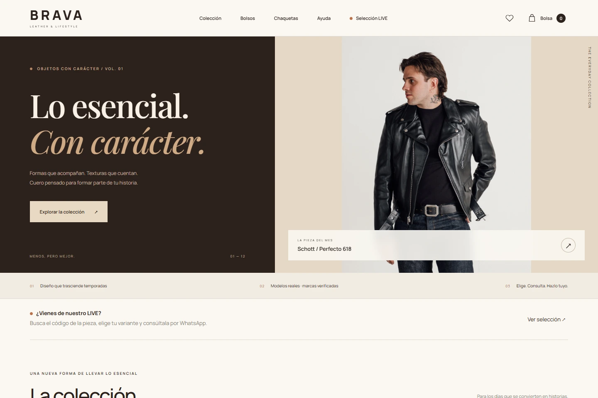
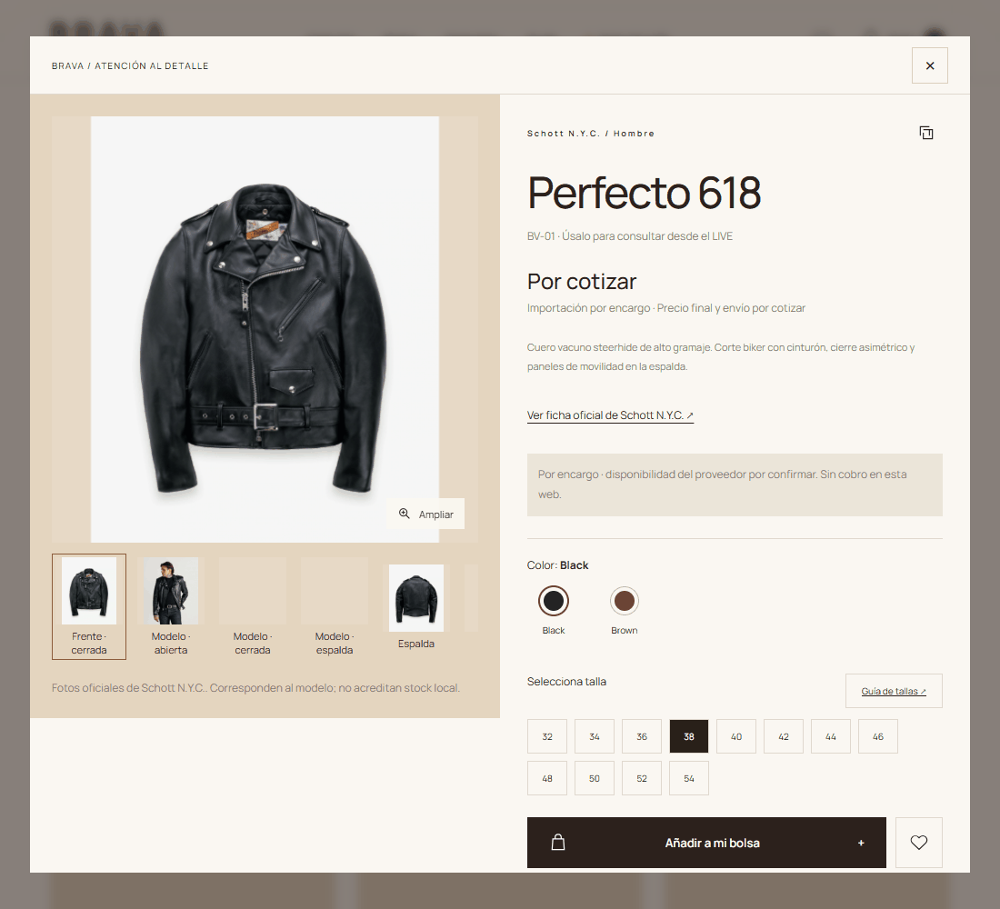
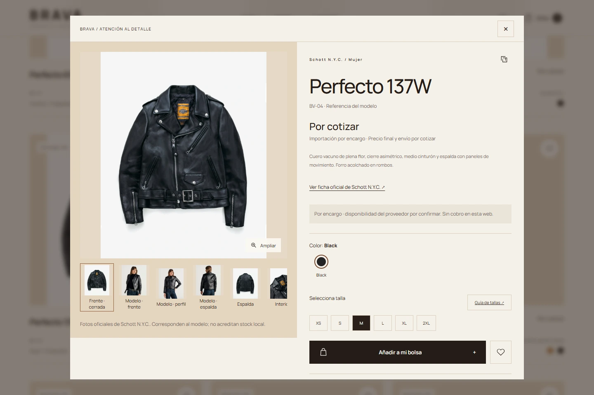
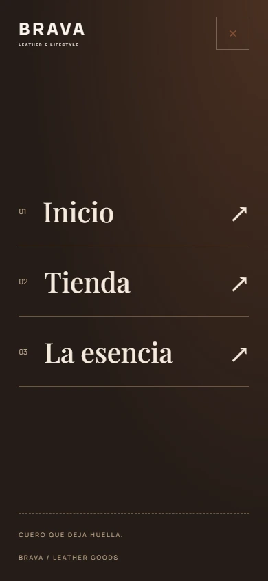
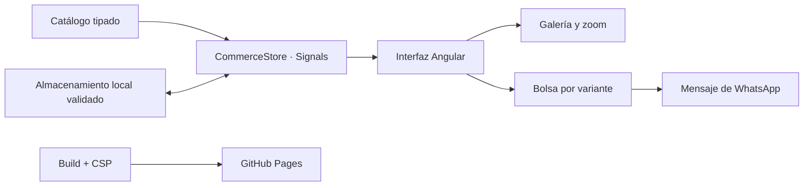

<div align="center">

# BRAVA

### Carácter que se lleva.

Una experiencia de compra de cuero con estética editorial, variantes claras y atención por WhatsApp.


[Explorar la tienda](https://analizajech.github.io/Brava/) · [Arquitectura](#arquitectura) · [Ejecutar](#ejecutar-en-local) · [Seguridad](SECURITY.md)



</div>

## Una pieza. Todos sus detalles.

BRAVA transforma un catálogo en una experiencia de compra asistida: encontrar una pieza, inspeccionarla desde diferentes ángulos, elegir color y talla y llevar una selección completa a WhatsApp. La interfaz utiliza una paleta espresso, marfil y cognac, tipografía editorial y controles personalizados.



> Selección por encargo: 12 modelos reales de Schott N.Y.C. y Portland Leather Goods, con fotos y variantes de sus fichas oficiales. La web no procesa pagos, acredita stock en Perú ni crea reservas. El precio final de importación y entrega se cotiza antes de confirmar la compra.

## La experiencia

| Descubrir                                                          | Elegir                                                                        | Consultar                                                          |
| ------------------------------------------------------------------ | ----------------------------------------------------------------------------- | ------------------------------------------------------------------ |
| 12 piezas, categorías, búsqueda por nombre o código BV y favoritos | Colores de fábrica, tallas originales y galerías independientes por variante | Bolsa persistente con variante exacta y solicitud de compra |
| Guardados independientes sin alterar categorías ni búsqueda        | Zoom con rueda, controles, arrastre, doble clic y pellizco                    | Mensaje por artículo con BV, marca, opción de fábrica, SKU, talla y cantidad        |
| Menú móvil de pantalla completa y navbar fijo                      | Fichas oficiales, cuidados y tablas de Schott en centímetros                                           | Información sobre envíos en Perú por Olva o Shalom                 |

<table><tr><td width="66%"></td><td width="34%"></td></tr></table>

### Imágenes independientes

Cada color y perspectiva utiliza su propio archivo WebP, codificado desde la imagen original sin aumentar artificialmente la resolución. No hay sprites, atlas, recortes compartidos ni desplazamientos de fondo para simular distintas vistas. El visor limita el zoom según su tamaño y la resolución nativa, con un máximo de 3×; la resolución nativa de las fotos oficiales va desde 1400 × 1400 hasta 2560 × 3200 píxeles.

Los archivos están en `public/images/products/{producto}/{color}-{vista}.webp`. El manifiesto `public/images/manifest.json` registra dimensiones y peso de cada recurso. [Procedencia y procesamiento](ASSETS.md).

## Una selección con procedencia

| Código | Modelo real | Uso | Fuente oficial |
| --- | --- | --- | --- |
| BV-01 | Perfecto 618 | Hombre · Chaquetas | [Schott N.Y.C.](https://www.schottnyc.com/products/618-classic-perfecto-steerhide-leather-motorcycle-jacket) |
| BV-02 | Café Racer 141 | Hombre · Chaquetas | [Schott N.Y.C.](https://www.schottnyc.com/products/141-classic-racer-leather-motorcycle-jacket) |
| BV-03 | Perfecto 626VNW | Mujer · Chaquetas | [Schott N.Y.C.](https://www.schottnyc.com/products/626vnw-women-s-vintaged-cowhide-motorcycle-jacket) |
| BV-04 | Perfecto 137W | Mujer · Chaquetas | [Schott N.Y.C.](https://www.schottnyc.com/products/137w-women-s-leather-motorcycle-jacket) |
| BV-05 | Crossbody Tote | Unisex · Bolsos | [Portland Leather Goods](https://www.portlandleathergoods.com/products/crossbody-tote) |
| BV-06 | Mini Crossbody Tote | Unisex · Bolsos | [Portland Leather Goods](https://www.portlandleathergoods.com/products/mini-crossbody-tote) |
| BV-07 | Classic Tote · Large | Unisex · Bolsos | [Portland Leather Goods](https://www.portlandleathergoods.com/products/classic-tote) |
| BV-08 | Tote Backpack · Large | Unisex · Mochilas | [Portland Leather Goods](https://www.portlandleathergoods.com/products/tote-backpack) |
| BV-09 | Quesadilla Wallet | Unisex · Accesorios | [Portland Leather Goods](https://www.portlandleathergoods.com/products/quesadilla-wallet) |
| BV-10 | Bifold Wallet | Unisex · Accesorios | [Portland Leather Goods](https://www.portlandleathergoods.com/products/bifold-leather-wallet) |
| BV-11 | Passport Wristlet | Unisex · Viaje | [Portland Leather Goods](https://www.portlandleathergoods.com/products/passport-wristlet) |
| BV-12 | Makeup Bag · Large | Unisex · Viaje | [Portland Leather Goods](https://www.portlandleathergoods.com/products/leather-makeup-bag) |

Fichas consultadas el **7 de octubre de 2026**. País de venta y país de fabricación se distinguen: las chaquetas seleccionadas de Schott indican fabricación en USA; no se atribuye ese origen a los accesorios Portland. No se anuncian ventas aseguradas ni relación de distribución oficial. [Datos y atribución de las fotos](docs/catalog-sources.json).

El centro de ayuda resuelve selección de tallas, materiales, cuidados, compras por encargo y envíos. WhatsApp se reserva para la solicitud comercial de la bolsa, organizada para identificar cada variante sin intercambiar mensajes sobre datos que ya están en la ficha.

## Arquitectura



| Capa                             | Responsabilidad                                                        |
| -------------------------------- | ---------------------------------------------------------------------- |
| `src/app/data/catalog.ts`        | Productos, colores, tallas, especificaciones y configuración comercial |
| `src/app/data/legal.ts`          | Privacidad, condiciones, envíos, cambios y atención                    |
| `src/app/core/commerce.store.ts` | Estado reactivo, bolsa por variante, favoritos y cotización            |
| `src/app/core/storage.ts`        | Persistencia tolerante a errores                                       |
| `src/app/shop.ts` / `shop.html`  | Navegación, modales, foco, gestos y presentación                       |
| `src/styles.css`                 | Identidad visual, adaptación móvil y estados accesibles                |
| `scripts/harden-build.mjs`       | Política CSP de producción                                             |

## Ejecutar en local

Requisitos: Node.js 22 y npm 10.9.9 (misma versión fijada en CI).

```bash
npm ci
npm start
```

Para revisar el mismo artefacto que se publica en GitHub Pages:

```bash
npm run build:pages
node scripts/preview.mjs
```

Abrir `http://127.0.0.1:4300/Brava/`.

## Publicar en GitHub Pages

El workflow `.github/workflows/pages.yml` compila y publica al hacer push a `master` o `main`. En **Settings → Pages → Source**, seleccionar **GitHub Actions**. También puede ejecutarse manualmente.

- Comando: `npm run build:pages`.
- Directorio: `dist/jechcommerce-front/browser`.
- Base: `/Brava/`. Ajustarla si cambia el nombre del repositorio.
- Los enlaces de producto usan `?pieza=ID`, compatibles con hosting estático.

## Seguridad y privacidad

Sin credenciales, cuentas, autenticación ni datos de tarjetas. Ciudad/distrito y transportista son opcionales: permanecen en memoria, sin persistencia ni envío a un servidor propio, y preparan el mensaje de compra. El almacenamiento local solo conserva referencias de producto y preferencias; se valida contra IDs, colores y tallas conocidos y se limita a cinco unidades por variante. Los precios se calculan desde el catálogo, no desde valores almacenados por el navegador.

Angular interpola texto sin HTML arbitrario. Los enlaces externos utilizan `noopener noreferrer` y el mensaje comercial se codifica. La compilación aplica CSP sin scripts inline ni `eval`. El usuario puede borrar bolsa y favoritos desde Privacidad. No se publica RUC, correo personal ni identidad del propietario.

GitHub Pages tiene límites para configurar headers HTTP; la seguridad del frontend no sustituye un backend de pagos, inventario o pedidos. [Detalles](SECURITY.md) · [Verificación](VALIDATION.md).

## Herramienta interna de precios

`tools/cost-calculator.html` simula compra USD, cambio manual, flete, margen, IGV configurable y envío por caja, separado o absorbido. Funciona localmente y **no se incluye en la tienda publicada**. Los datos de ejemplo no son cotizaciones ni determinan obligaciones tributarias.

## Antes de iniciar ventas

Confirmar inventario por lote, costo final, disponibilidad, tarifas, plazos y condiciones de cambios; habilitar el canal formal de reclamaciones correspondiente. La documentación describe el estado real del prototipo, sin reseñas, stock o garantías inventadas. [Preparación comercial](BUSINESS-LAUNCH.md).

---

Diseño e implementación de BRAVA · [Identidad visual](BRAND.md)

## Diseño y navegación

Inicio, Tienda y La esencia. Categorías solo en la tienda; guardados en un panel independiente; ayuda y políticas en el footer. Identidad de cuero, costuras y latón documentada en [DESIGN-SYSTEM.md](DESIGN-SYSTEM.md).
